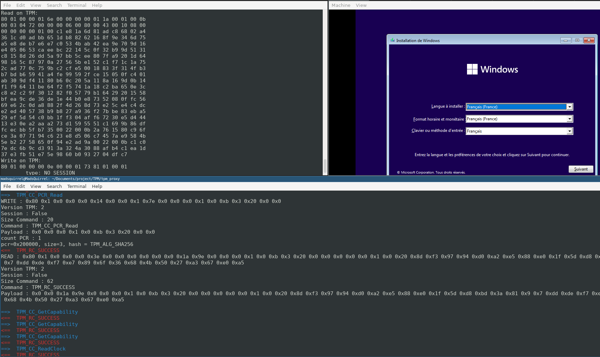

# README


## GOAL

This project, intercept TPM communiction between an OS and a physical TPM.
For the moment you can only show the communication and not altered the
communication.

The following example show the communication with the tpm of thinkpad 490 and
Windows 11 installation:



On this example, the filter is setup to show `TPM_CC_PCR_Read` request/response
details.


## Installation

First of all to intercept communication you need to recompile qemu project with
`qemu.patch`

```bash
git clone git clone https://gitlab.com/qemu-project/qemu.git
git apply qemu.patch
./configure
make qemu-system-x86_64
```

## Use

For the moment the code is dirty and not really usable as end user.
But you can run server.py and on an other tty launch your pathed qemu as
follow:

```bash
touch /tmp/cancel
qemu-system-x86_64 -tpmdev passthrough,path=<your_tpm_path>,id=tpm0,cancel-path=/tmp/cancel -device tpm-tis,tpmdev=tpm0

python3.7 server.py

```

For the moment server create a socket here: /tmp/so.s

If you want to modify the apparence of the TPM content:
```python3
arg = TypeShow.BEAUTY
# OR
arg = TypeShow.RAW
```

For Beauty you can configure a filter here with the request you want:

```python3
def process_beauty(...
...
commands = [ 'TPM_CC_PCR_Read', ...]
...
```
